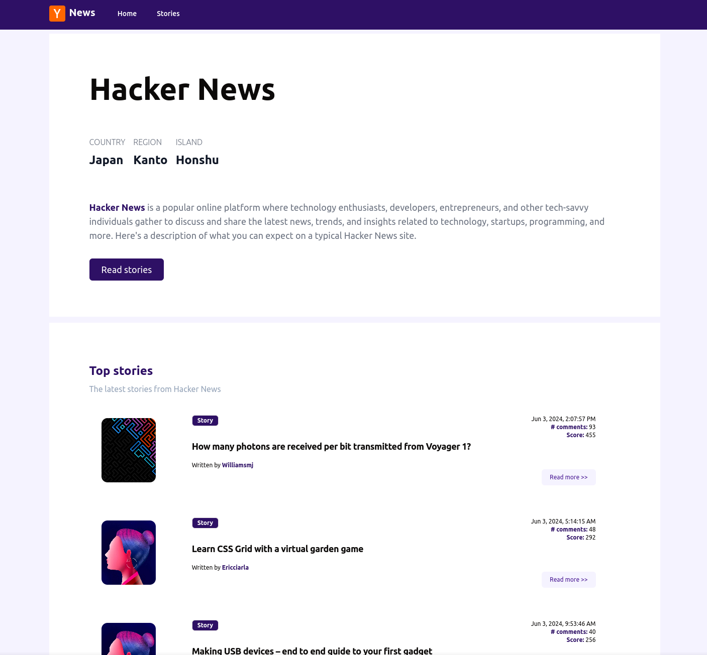

# [Hacker News](https://665df4ad6ca68e1bf8c49c13--hackernews-edd.netlify.app/)

<div align="center">
 
</div>

## Description

[Hacker News](https://665df4ad6ca68e1bf8c49c13--hackernews-edd.netlify.app/) is a popular online platform where technology enthusiasts, developers, entrepreneurs, and other tech-savvy individuals gather to discuss and share the latest news, trends, and insights related to technology, startups, programming, and more. Here's a description of what you can expect on a typical [Hacker News](https://665df4ad6ca68e1bf8c49c13--hackernews-edd.netlify.app/) site.

## Setup

Clone and install the dependencies:

```bash
1) git clone git@github.com:eddremonts86/HackerNews.git
2) cd HackerNews
3) pnpm install

Or

git clone git@github.com:eddremonts86/HackerNews.git && cd HackerNews && pnpm install
```

## Development Server

Start the development server on `http://localhost:3000`:

```bash
pnpm run dev
```

Locally preview production build:

```bash
pnpm run preview
```

## Production

Build the application for production:

```bash
pnpm run build
```
